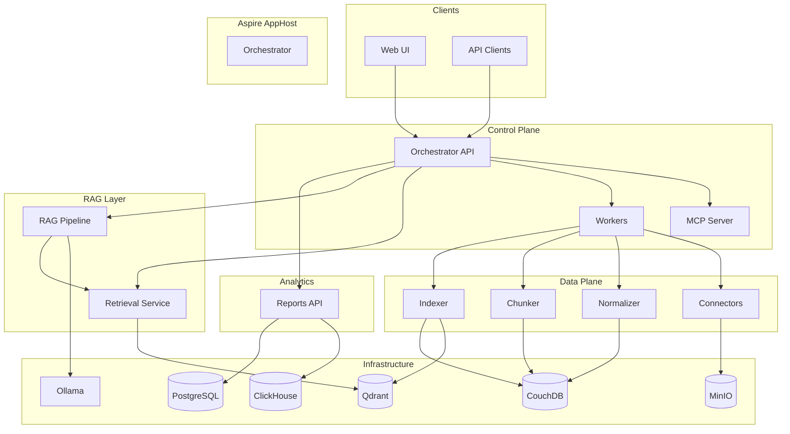

# Icarus Overview

Icarus is an **on-premises RAG (Retrieval-Augmented Generation) platform** for enterprise document intelligence. It enables organizations to ingest, process, and query their document corpus using AI-powered search and chat—all while keeping data within their own infrastructure.

## Key Capabilities

- **Document Ingestion**: Connect to enterprise sources (SharePoint, S3, file systems, APIs) and normalize content into a unified format
- **Semantic Search**: Vector embeddings and hybrid search over your document corpus
- **RAG Chat**: Conversational AI that grounds responses in your documents with citations
- **Analytics**: Usage metrics, retrieval quality, and operational reports

## Key Components

| Component | Technology | Purpose |
|-----------|------------|---------|
| **Orchestration** | .NET Aspire | Service discovery, health checks, distributed tracing |
| **Architecture** | Clean Architecture | Domain-driven design with clear boundaries |
| **Streaming** | SSE (Server-Sent Events) | Real-time token streaming for chat responses |
| **Embeddings** | Rust | High-performance embedding generation |
| **Vector DB** | Qdrant | Vector storage and similarity search |
| **Document Store** | CouchDB | Document metadata and raw content |
| **Relational DB** | PostgreSQL | Jobs, users, audit data |
| **Object Storage** | MinIO | Blob storage for files and artifacts |
| **Analytics DB** | ClickHouse | Time-series metrics and analytics |
| **LLM** | Ollama | Local LLM inference (or compatible API) |

## High-Level Architecture

## Why On-Premises?

- **Data sovereignty**: Documents never leave your network
- **Compliance**: Meet regulatory requirements (HIPAA, GDPR, SOC2)
- **Latency**: Low-latency access to internal documents
- **Cost control**: No per-token cloud API costs for embeddings or LLM (when using Ollama)

## Getting Started

- [Architecture Details](01-architecture.md) — Deep dive into system design
- [Local Development](02-local-dev-with-aspire.md) — Run Icarus locally with Aspire
- [Configuration](03-configuration.md) — Environment and app settings
- [Data Contracts](04-data-contracts.md) — API request/response schemas
