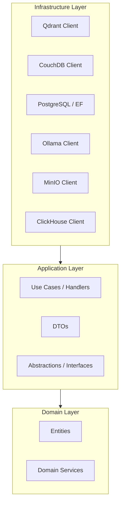
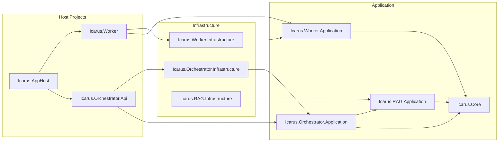

# Icarus Architecture

This document describes the detailed architecture of Icarus, including the Control Plane, Data Plane, RAG layer, Analytics, and Clean Architecture boundaries.

## System Layers

### Control Plane

The Control Plane manages orchestration, job scheduling, and external integrations.

| Component | Responsibility |
|-----------|-----------------|
| **Orchestrator API** | REST API for registering sources, triggering ingestion, chat, and admin operations. Entry point for all client requests. |
| **MCP Server** | Model Context Protocol server for AI tool integration. Exposes Icarus capabilities (search, ingest) to LLM agents. |
| **Workers** | Background job processors. Execute connector runs, normalization, chunking, and indexing asynchronously. |

### Data Plane

The Data Plane handles document ingestion and preparation for retrieval.

| Component | Responsibility |
|-----------|-----------------|
| **Connectors** | Pull documents from external sources (SharePoint, S3, filesystem, custom APIs). Output raw blobs to MinIO. |
| **Normalizer** | Convert raw documents to a unified `NormalizedDocument` format. Extract text, metadata, and structure. |
| **Chunker** | Split normalized documents into `TextChunk` units for embedding. Supports semantic and fixed-size strategies. |
| **Indexer** | Generate embeddings (via Rust service), upsert vectors to Qdrant, store chunk metadata in CouchDB. |

### RAG Layer

The RAG layer powers semantic search and grounded chat.

| Component | Responsibility |
|-----------|-----------------|
| **Retrieval** | Execute vector + keyword search against Qdrant. Return ranked `RetrievalResult` items with scores. |
| **RAG Pipeline** | Orchestrate retrieval → context assembly → LLM prompt → response generation. Streams tokens via SSE. |

### Analytics

| Component | Responsibility |
|-----------|-----------------|
| **Reports API** | Query ClickHouse for usage metrics, latency, error rates. Query Postgres for job status, user activity. |

---

## Clean Architecture Boundaries

Icarus follows Clean Architecture with three primary layers:



### Domain

- **Entities**: `Document`, `Chunk`, `Source`, `RetrievalResult`
- **Domain Services**: Business rules, validation logic
- **No dependencies** on external frameworks or infrastructure

### Application

- **Use Cases**: Register source, ingest documents, chat, retrieve
- **DTOs**: Request/response models for APIs
- **Interfaces**: `IVectorStore`, `IDocumentStore`, `IEmbeddingService`, `ILLMClient`
- **Depends only on Domain**

### Infrastructure

- **Implementations**: Concrete clients for Qdrant, CouchDB, Postgres, MinIO, ClickHouse, Ollama
- **Depends on Application** (implements interfaces)

---

## Project Dependency Diagram



---

## Data Flow

### Ingestion Flow

```
Source → Connector → MinIO (raw) → Normalizer → CouchDB (normalized)
                                              → Chunker → CouchDB (chunks)
                                                        → Indexer → Rust Embeddings
                                                                  → Qdrant (vectors)
```

### Chat Flow

```
User Message → Orchestrator API → RAG Pipeline
                                    → Retrieval (Qdrant) → Context
                                    → LLM (Ollama) → Token stream
                                    → SSE → Client
```

---

## Technology Choices

| Choice | Rationale |
|--------|-----------|
| **Qdrant** | Strong vector search, filtering, and hybrid search support |
| **CouchDB** | Document store with flexible schema, good for heterogeneous content |
| **PostgreSQL** | Reliable relational store for jobs, users, and transactional data |
| **MinIO** | S3-compatible object storage for blobs |
| **ClickHouse** | Optimized for analytics and time-series queries |
| **Ollama** | Local LLM inference, no external API dependency |
| **Rust embeddings** | Performance-critical path; Rust offers low latency and high throughput |
